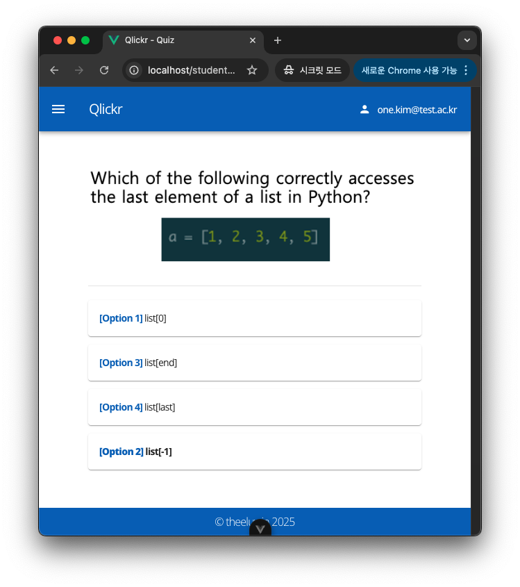
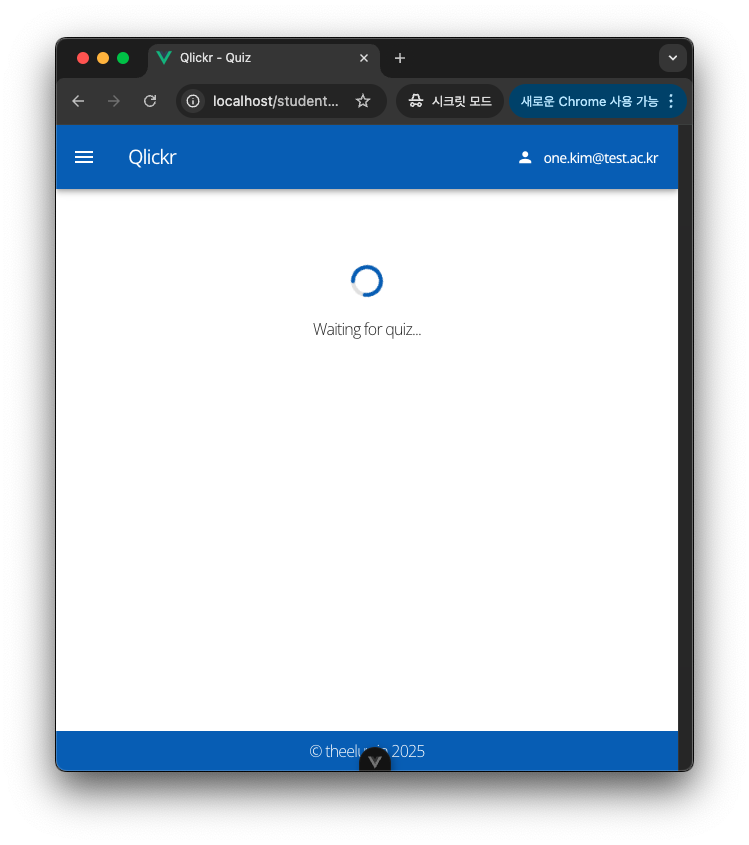
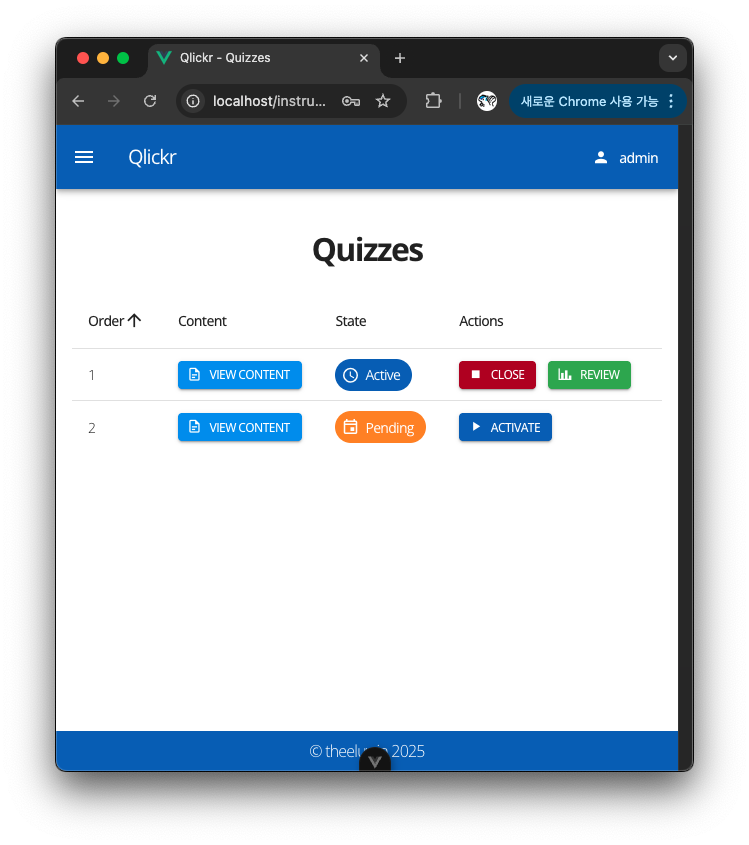
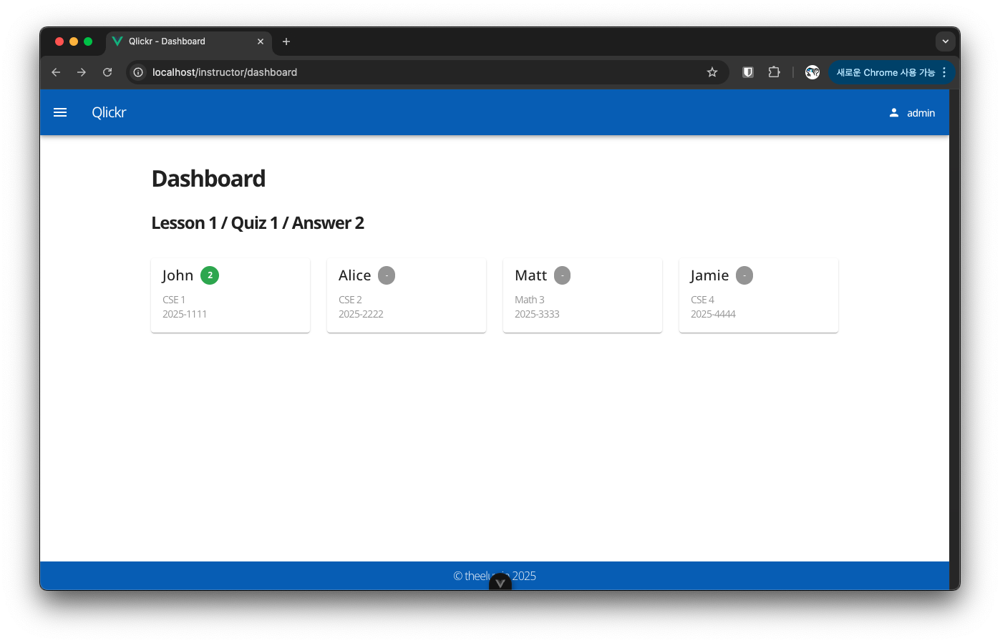
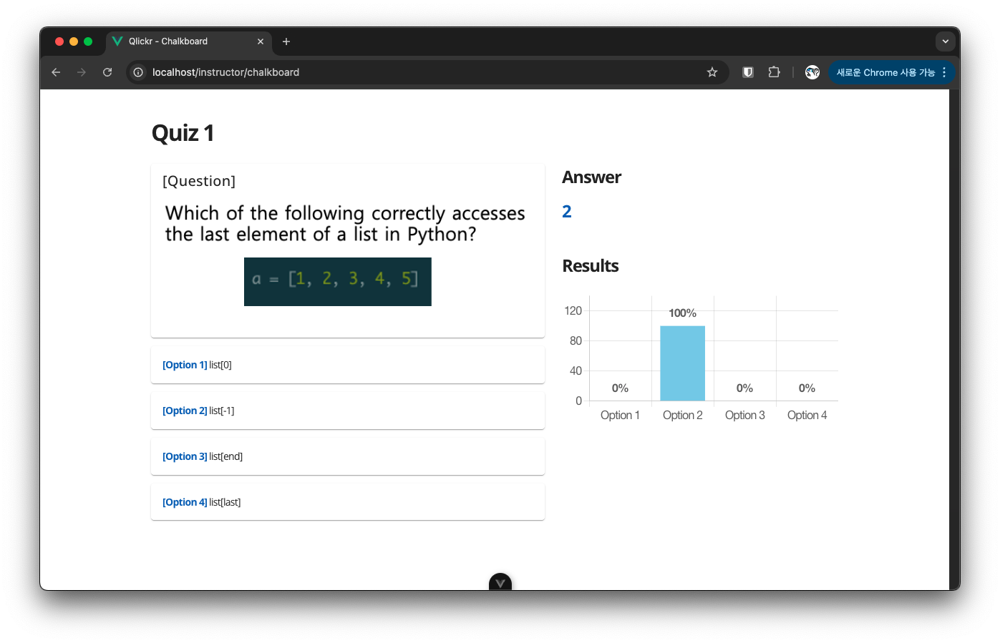

# Qlickr

Qlickr is a real-time quiz platform designed for class instructors.

It is recommended to use Qlickr either before or at the end of a class.

When the quiz begins, the quiz questions appear on students' screens. Students click to submit the answers they believe are correct. Once the quiz ends, students can no longer view the questions or submit answers.

Quiz results can be displayed using a chalkboard feature, showing the percentage of students who selected each answer. This helps instructors provide additional explanations for questions with high incorrect response rates.

## Gallery

### Student's view

Quiz.



Waiting for quiz.



### Instructor's view

Quiz management (private).



Dashboard (private).



Chalkboard (use projector).



## Installation

The basic structure is the same as [Pocket Galaxy](https://github.com/theeluwin/pocket-galaxy).

### Development

**NEVER** deploy the site with development setting.

1. Create `.env.dev` file (see `.env.sample`)

2. Use alias

    ```bash
    dev() {
        docker compose --env-file ./.env.dev --file ./compose/dev.yml "$@"
    }
    ```

3. Build docker images

    ```bash
    dev build
    ```

4. Run dev (this will init your database if not exist)

    ```bash
    dev up --build --detach
    ```

5. Create admin

    ```bash
    dev run --rm backend python manage.py createsuperuser
    ```

6. Shut down

    ```bash
    dev down
    ```

### Production

**ALWAYS** use SSL.

1. Create `.env.prod` file (see `.env.sample`)

2. For domain setting, you should edit:

    * `.env.prod`
    * `confs/certbot.conf`
    * `confs/prod.conf`

3. Just in case, edit other magic strings:

    * `frontend/index.html`
    * `frontend/package.json`
    * `frontend/package-lock.json`
    * `frontend/src/constants.ts`

4. Achieve certification

    ```bash
    ./scripts/cert-init.sh
    ```

5. Auto-renew the certification

    ```bash
    crontab -e
    ```

    ```bash
    0 2 * * * /your-path-to-qlickr/scripts/cert-renew.sh
    ```

6. Use alias

    ```bash
    prod() {
        docker compose --env-file ./.env.prod --file ./compose/prod.yml "$@"
    }
    ```

7. Build docker images

    ```bash
    prod build
    ```

8. Run prod (this will init your database if not exist)

    ```bash
    prod up --build --detach
    ```

9. Create admin

    ```bash
    prod run --rm backend python manage.py createsuperuser
    ```

10. Shutdown

    ```bash
    prod down
    ```

## Manual

### Admin

You can manage data through the [Django Admin](https://docs.djangoproject.com/en/5.2/ref/contrib/admin/) interface by accessing `/api/admin` and logging in with an admin account.

Students' project, midterm, and finals scores can be directly modified here.

### Lesson

Each quiz belongs to a specific lesson.

Quizzes can only be activated when the lesson is in the active state. Grading is performed exclusively on lessons that are in the closed state.

Grading can be done as follows:

```bash
prod run --rm backend python manage.py evaluate
```

This automatically calculates the student's quiz scores and stores them in the database.

### Quiz

Each quiz has a unique `order` value within its lesson.

Only single-answer quizzes are provided, and the correct answer must point to the `order` of an option. Likewise, each option has a unique `order` value within its quiz.
